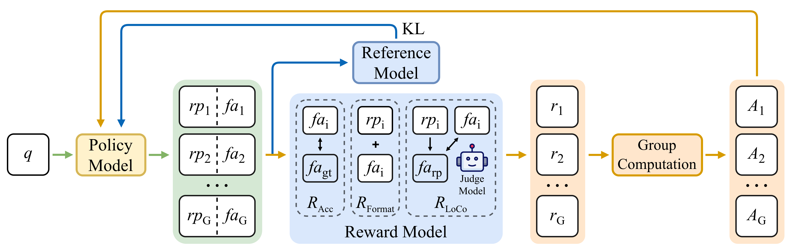
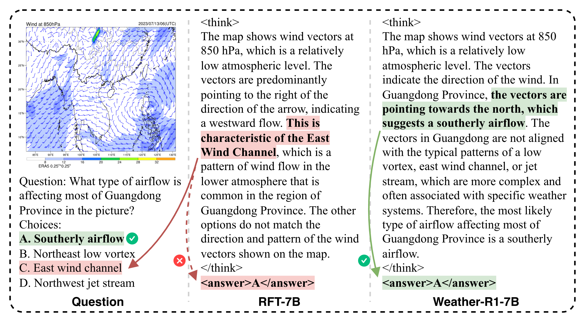
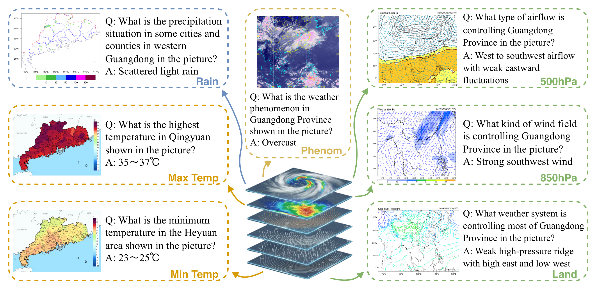

<h1 align="center">
Weather-R1: Logically Consistent Reinforcement Fine-Tuning for Multimodal Reasoning in Meteorology
</h1>

<div align="center">
<p><em>
A reasoning VLM with logical faithfulness in meteorology.
</em></p>
<a href="https://arxiv.org/abs/2601.14044"></a>
<a href="https://huggingface.co/Marco711/Weather-R1"></a>
<a href="https://huggingface.co/datasets/Marco711/WeatherQA"></a>
<p>
<a href="mailto:wuky28@mail2.sysu.edu.cn">Kaiyu Wu</a>, <a href="mailto:hanpch@gd121.cn">Pucheng Han</a>, <a href="mailto:zhlchris@126.com">Hualong Zhang</a>, <a href="mailto:wunaigeng@hotmail.com">Naigeng Wu</a>, <a href="mailto:kezewang@gmail.com">Keze Wang</a>
</p>
<p>
[ English | <a href="README_zh.md">中文</a> ]
</p>
</div>

# Overview

- [Introduction](#introduction)
- [Highlights](#highlights)
- [Folder Structure](#folder-structure)
- [Setup](#setup)
- [Training](#training)
- [Evaluation](#evaluation)
- [Acknowledgements](#acknowledgements)
- [Citation](#citation)

<a id="introduction"></a>
# 🌤️ Introduction

While Vision Language Models (VLMs) show advancing reasoning capabilities, their application in meteorology is constrained by a domain gap and a reasoning faithfulness gap. Mainstream Reinforcement Fine-Tuning (RFT) can induce Self-Contradictory Reasoning (Self-Contra), where the reasoning process contradicts the final answer, which is unacceptable in this high-stakes domain.

To address these challenges, we construct WeatherQA, a multimodal multiple-choice benchmark for meteorology comprising 15,400 entries that cover four themes and seven imaging modality tasks. We propose Logically Consistent Reinforcement Fine-Tuning (LoCo-RFT), which introduces a logical consistency reward to resolve Self-Contra. Based on this paradigm and WeatherQA, we present Weather-R1, the first reasoning VLM with logical faithfulness in meteorology, to the best of our knowledge. Weather-R1 (7B) achieves 52.9% accuracy on WeatherQA, a 9.8 percentage point gain over the baseline model Qwen2.5-VL-7B; it surpasses Supervised Fine-Tuning and RFT baselines, exceeds the original Qwen2.5-VL-32B, and improves out-of-domain ScienceQA performance by 4.98 percentage points.

<a id="highlights"></a>
# ✨ Highlights

- LoCo-RFT augments RFT with a logical consistency reward to suppress the Self-Contradictory Reasoning (Self-Contra) phenomenon by aligning the reasoning process with the final answer.

<div align="center">
  
  <p><em>Our LoCo-RFT (Logically Consistent Reinforcement Fine-Tuning) paradigm.</em></p>
</div>

- Weather-R1 is the first logically consistent reasoning VLM tailored for meteorology, trained with LoCo-RFT to provide faithful multimodal reasoning.

<div align="center">
  
  <p><em>Response Comparison.</em></p>
</div>

- WeatherQA is a multimodal multiple-choice benchmark for meteorology comprising 15,400 entries across four themes and seven imaging modality tasks, providing high-quality supervision for domain-specialized reasoning and evaluation.

<div align="center">
  
  <p><em>Data sample of our WeatherQA.</em></p>
</div>

- Weather-R1 (7B) reaches 52.9% accuracy on WeatherQA, a 9.8 percentage point gain over the baseline Qwen2.5-VL-7B; it surpasses SFT and RFT baselines, exceeds Qwen2.5-VL-32B, and improves OOD ScienceQA by 4.98 percentage points.

<a id="folder-structure"></a>
# 🗂️ Folder Structure

```file tree
Weather-R1
├── README.md
├── data/                     # Place datasets here
│   ├── WeatherQA/            # Train/val/test splits and images
│   └── ScienceQA-Weather-R1/ # OOD ScienceQA evaluation set and images
├── easyr1/                   # EasyR1 submodule
├── models/                   # Downloaded models/checkpoints
├── requirements/             # Environment lock files (for reference)
├── results/                  # Training/eval outputs
├── scripts/                  # Setup, training, and evaluation entrypoints
└── src/                      # Training/evaluation source
    ├── eval/                 # Metrics, answer generation, Self-Contra stats
    ├── models/               # Model wrappers (Qwen, LLaVA, API)
    ├── utils/                # Prompts, paths, and helpers
    └── weather_r1/           # Core LoCo-RFT code, includes config, reward, and formatting templates
```

<a id="setup"></a>
# 🛠️ Setup

## vLLM (Judge Model) Environment

- Follow the official vLLM installation guide: https://docs.vllm.ai/en/v0.10.1.1/getting_started/installation/gpu.html
- Exported `pip` and `conda` environment files are provided at [`requirements/vllm-pip-requirements.txt`](requirements/vllm-pip-requirements.txt) and [`requirements/vllm-conda-list.txt`](requirements/vllm-conda-list.txt); use them to check dependencies.

```bash
conda create -n vllm-weather-r1 python=3.12
conda activate vllm-weather-r1
pip install vllm==0.10.1.1 --extra-index-url https://download.pytorch.org/whl/cu128
```

## EasyR1 (LoCo-RFT Training) Environment

- Match the official EasyR1 v0.3.1 environment; see the installation steps in the [EasyR1 README](easyr1/README.md).
- Exported `pip` and `conda` environment files are at [`requirements/easyr1-pip-requirements.txt`](requirements/easyr1-pip-requirements.txt) and [`requirements/easyr1-conda-list.txt`](requirements/easyr1-conda-list.txt); use them to check dependencies.
- Based on the [EasyR1 v0.3.1 Dockerfile](easyr1/Dockerfile), we provide a one-click install script [`scripts/easyr1_install.sh`](scripts/easyr1_install.sh) for required dependencies.

```bash
conda create -n easyr1-weather-r1 python=3.10
conda activate easyr1-weather-r1
cd easyr1
bash ../scripts/easyr1_install.sh
```

## Data and Model Preparation

- Data
  - WeatherQA: download from https://huggingface.co/datasets/Marco711/WeatherQA and place it under `data/WeatherQA`.
  - ScienceQA-Weather-R1: download from https://huggingface.co/datasets/Marco711/ScienceQA-Weather-R1 and place it under `data/ScienceQA-Weather-R1`.
- Models
  - Training model: download `Qwen2.5-VL-7B-Instruct` from https://huggingface.co/Qwen/Qwen2.5-VL-7B-Instruct and place it under `models/Qwen/Qwen2.5-VL-7B-Instruct`.
  - Judge model: download `openai/gpt-oss-20b` from https://huggingface.co/openai/gpt-oss-20b and place it under `models/openai/gpt-oss-20b`.
- Before evaluation, fill [`src/utils/model_path.json`](src/utils/model_path.json) with the local paths or Hugging Face model names to test.

<a id="training"></a>
# 🚀 Training

1. Start the judge model (only this step uses the vLLM env):
    ```bash
    conda activate vllm-weather-r1
    bash scripts/start_vllm_judge_model.sh
    ```
2. Edit the training script [`scripts/qwen2_5_vl_7b_weather_r1_locorft_bf16.sh`](scripts/qwen2_5_vl_7b_weather_r1_locorft_bf16.sh). Key arguments:
    - `EXPERIMENT_NAME`: experiment name and output folder
    - `TRAIN_FILE`: training split path
    - `REWARD_WEIGHTS`: reward weights for LoCo-RFT
    - `CLIENT_MODEL`: judge model type
    - Other parameters as needed
3. Train Weather-R1 with LoCo-RFT (EasyR1 environment for this and later steps):
    ```bash
    conda activate easyr1-weather-r1
    bash scripts/qwen2_5_vl_7b_weather_r1_locorft_bf16.sh
    ```
4. Merge checkpoints after training (adjust `local_dir` to your run):
    ```bash
    python easyr1/scripts/model_merger.py --local_dir checkpoints/easy_r1/exp_name/global_step_1/actor
    ```

## Baseline Training

- RFT: follow the LoCo-RFT pipeline; disable the logic reward by uncommenting line 21 in [`scripts/qwen2_5_vl_7b_weather_r1_locorft_bf16.sh`](scripts/qwen2_5_vl_7b_weather_r1_locorft_bf16.sh): `REWARD_WEIGHTS ('{"format":0.1,"logic":0.0,"accuracy":0.9}')`.
- SFT: follow [LlamaFactory](https://github.com/hiyouga/LlamaFactory.git) for SFT training.

<a id="evaluation"></a>
# 📊 Evaluation

## Qwen-2.5-VL Series

1. Set model paths: fill [`src/utils/model_path.json`](src/utils/model_path.json) with the model names and paths to test.
2. Configure the model and dataset to evaluate: set `model_name` and `data_type` (`SQA_qcm_a` / `WCQ_en`) in [`scripts/eval_scienceqa_weatherqa_multi_gpu.sh`](scripts/eval_scienceqa_weatherqa_multi_gpu.sh), and choose `prompt_type` (e.g., `weather-r1`) to match the corresponding prompts.
3. Run the evaluation script:
    ```bash
    bash scripts/eval_scienceqa_weatherqa_multi_gpu.sh
    ```

## LLaVA-v1.6 Series

- Refer to the [LLaVA](https://github.com/haotian-liu/LLaVA) repo for environment setup.
- The remaining steps are similar to the Qwen-2.5-VL series.

## Statistical Analysis

### Main Experiment Metrics

1. Update the `folder` path in [`src/eval/get_metric.py`](src/eval/get_metric.py) to the directory to summarize.
2. Run the metric aggregation script:
    ```bash
    python -m src.eval.get_metric
    ```

### Self-Contra Statistics

1. Use the judge model to obtain the final answer of the reasoning process ($fa_{rp}$):
    ```bash
    python -m src.eval.get_final_answer_of_reasoning_process
    ```
2. Count the Self-Contra phenomenon:
    ```bash
    python -m src.eval.self_contra_count -i <folder_of_fa_rp_jsonl> -o <output_csv_path>
    ```

<a id="acknowledgements"></a>
# 🙏 Acknowledgements

Training code is built on [EasyR1](https://github.com/hiyouga/EasyR1).

<a id="citation"></a>
# 📝 Citation

If you use Weather-R1 resources, please cite the following paper:

```bibtex
@misc{wu2026weatherr1logicallyconsistentreinforcement,
      title={Weather-R1: Logically Consistent Reinforcement Fine-Tuning for Multimodal Reasoning in Meteorology}, 
      author={Kaiyu Wu and Pucheng Han and Hualong Zhang and Naigeng Wu and Keze Wang},
      year={2026},
      eprint={2601.14044},
      archivePrefix={arXiv},
      primaryClass={cs.CV},
      url={https://arxiv.org/abs/2601.14044}, 
}
```
